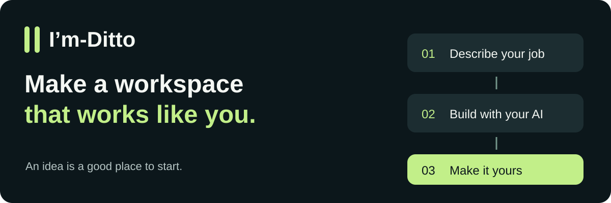

<p align="center"></p>

<p align="center"><strong>Your idea. Your AI. Your own kind of app.</strong></p>
<p align="center"><a href="https://github.com/Martin123132/im-ditto/releases/tag/v0.1.0-preview.8">Download the Windows preview</a> · <a href="docs/MAKE_YOUR_OWN_IM.md">Make your first I’m</a> · <a href="docs/CREATOR_JOURNEY.md">See a real build</a> · <a href="REVIEW.md">Review this version</a></p>

**I’m-Ditto helps you make a workspace around the way you work.** Describe a job, ask your connected AI to build the controls and tools, then use that workspace together. You click and edit; your AI works on the same saved project.

A rehearsal desk. A workshop for game ideas. A video studio with just the controls you need. The point is not to pick from our apps. **The point is to make yours.**

You do not have to write the code yourself. Your AI does that part—but you still try what it builds, review it, and decide what is allowed to run.

> **Early preview · Windows x64.** Generated apps run as your Windows user, not inside an operating-system sandbox. Only install code you trust. [Understand the boundaries →](DITTO_SECURITY.md)

**Preview 8:** clearer creator rights, an MIT starter with notices preserved in
your builds, and plain-language help. It retains the corrected Windows launcher
and optional Bridge reply clocks. [What changed](docs/releases/0.1.0-preview.8.md).
No Accessibility app, bundled example or clock-enabled Bridge is required for
the creator journey. The clock display requires a compatible updated Bridge;
this ZIP does not update Bridge.

## Start with a sentence

> “Keep a set list and practice notes, let me and my AI edit them, and export a session plan.”

That was the starting brief for this rehearsal desk—not a pre-installed template for music.


We built it through ChatGPT and PC Bridge, added work by hand, asked ChatGPT to change that same work, exported the plan, and checked it after a restart. [Follow the actual journey, including what needed help →](docs/CREATOR_JOURNEY.md)

## Make your own in five steps

1. **Open I’m-Ditto.** Download the Windows ZIP, extract it, then double-click **Launch Im-Ditto.cmd**. The required Node runtime is included.
2. **Describe your job.** Start on **Make my I’m**. Give it a name and say what you want to bring in, change and get out.
3. **Build with your AI.** Copy the prepared prompt into your connected ChatGPT chat or local Codex task. It needs access to the new build folder. Your AI implements and tests the idea.
4. **Review and open.** Return to **Check finished package**. Review the files and access before trusting that version. Start it from **My I’ms**.
5. **Keep shaping it.** Use it, ask for improvements, review the update, and keep your saved work.

**Not sure what to write?** Open **How to Ditto → Walk me through making my own**. It explains the method and gives you a brief to adapt—not an app you must install.

[Plain-language quick start](docs/DITTO_QUICK_START.md) · [Full creation walkthrough](docs/MAKE_YOUR_OWN_IM.md) · [Connection video and guide](docs/DITTO_TUTORIAL.md)

## Bring the AI you already use

- **ChatGPT with PC Bridge:** use your existing owner-controlled connection. New connections use [PC Bridge’s setup](https://github.com/Martin123132/PC-Bridge). Account and tool availability vary.
- **Codex on your PC:** give it access to the intended build folder and paste the generated prompt. No separate Bridge connection is needed for local commands.
- **Just you:** once an I’m is built and running, use its ordinary controls without a live AI conversation.

I’m-Ditto is not another model subscription. It does not contain an AI model or automatically send your prompts. AI work still uses your chosen provider and its normal limits or charges. [How the connection works →](DITTO_CONNECT.md)

## Three examples, not three limits

| The example | What it illustrates |
| --- | --- |
| **#1 · The personal PC Bridge** | The original workspace built around its owner’s way of using AI. Separate, not replaced by Ditto. |
| **#2 · Video Studio** | Pictures, music, captions and MP4 export. An optional bundled example; requires FFmpeg and FFprobe. |
| **#3 · Board-Game Workshop** | Rules, cards and printable prototypes. An optional bundled example using the included runtime. |

The rehearsal desk is our creation walkthrough, not another required download. [Read the build stories and adapt their briefs →](EXAMPLE_RECIPES.md)

## You stay in charge

Review each package before installation. Start and stop apps locally. Keep saved projects separate from installed code. A stopped app can be updated or rolled back; removing it keeps its saved data. There are no silent app updates or automatic permission grants.

These controls help manage trusted code. **They do not contain malicious code.** Declared access is a description, not an OS restriction; hashes check files, not the publisher’s identity. Have unfamiliar code reviewed before running it.

## Common questions

**Do I need to know how to code?** Not to describe the job or use the interface. Building still involves code, tests and trust decisions. Your AI can help explain them; we are not claiming that every idea works first time or needs no review.

**Does it build absolutely anything?** No. Start with a small useful job. External services, specialist programs, hardware and complex applications need their own integrations, permissions and tests.

**Where is my work?** In your local Ditto profile. Back up `local-profile/workspaces/` and your editable builds. Never replace your profile with a download. The AI may see information you give it or authorize it to read.

**Is there an I’m-Store?** Not yet. The longer-term idea is a place for creators to share or sell ready-made I’ms. Making your own and paying for convenience can coexist. This preview has no store, checkout, creator payments or publisher certification.

**Can I use it on Mac or Linux?** This packaged preview is tested on Windows x64. Other platforms have not been qualified.

## For builders and reviewers

The host and starter use Node built-ins. For a source checkout, install Node 22+ through a trusted source, then:

```sh
npm run test:core
npm run check:release
npm start
```

No `npm install` is required for the host or core tests. `npm test` additionally
runs the Studio render checks and needs FFmpeg and FFprobe on PATH. The external
Bridge integration check is skipped unless its separate module is supplied;
normal Ditto use does not require that module. The Windows workflow covers core
tests on Node 22 and 24, not a full installer, media or external-Bridge test.
Already have this repository? Pull `main` normally after saving any local changes.
If you do not want to install Node, use the Windows ZIP linked above instead.
Keep existing profile/workspace folders; do not replace them with a download.

- [Creator contract](creator-template/README.md) — build an interface and finite AI commands over shared state.
- [Host guide](DITTO_README.md) — installation, updates, rollback and packaging.
- [Review notes](REVIEW.md) — checks, evidence, known limits and release boundary.
- [Help and troubleshooting](docs/SUPPORT.md) · [Contributing](CONTRIBUTING.md) · [Security](SECURITY.md) · [Product direction](PRODUCT_DIRECTION.md).

## Make it yours

Preview 8 uses the licence split below. Earlier releases retain their original terms; they have not been replaced.

The designated creator starter is MIT licensed: adapt it for free or paid I’ms and keep its notices. Your own additions can use your own terms. There is no compulsory store listing or royalty on your independent sales. [Your creator rights](CREATOR_RIGHTS.md)

The host, including the company launcher, uses a separate source-available [Core licence](LICENSES/Im-Ditto-Core-1.0.md), with a restriction on repackaging protected Core code as a general-purpose platform for others. It is not OSI-approved open source. Inherited Bridge code, existing examples and third-party works retain the exceptions in the [file schedule](LICENSE); earlier grants are not revoked.

Built by **Two Hands Network Ltd**, from its PC Bridge foundation. Not affiliated with or endorsed by OpenAI, Nous Research or OpenClaw.
