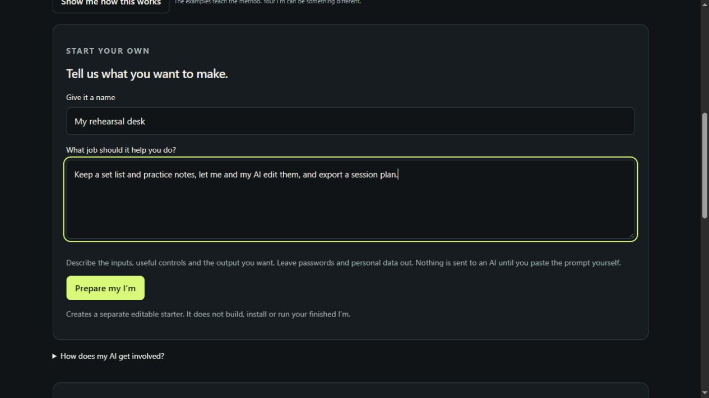
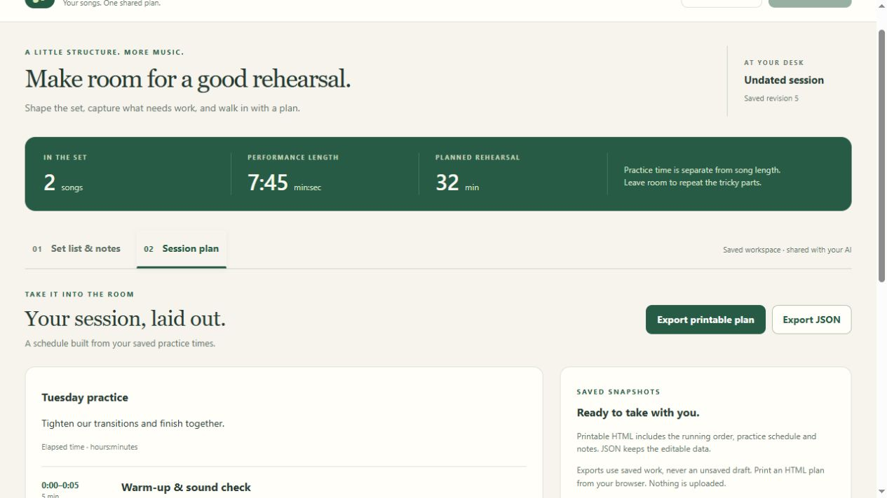
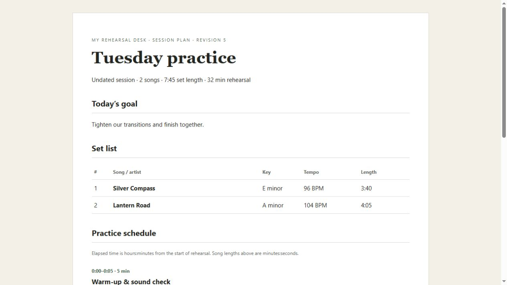
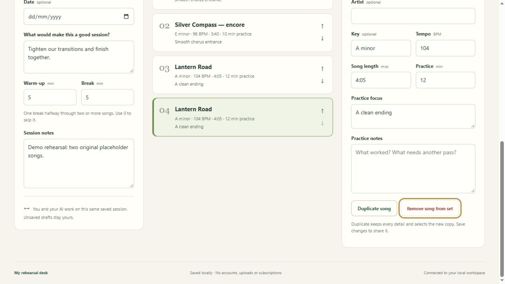

# From a sentence to a workspace

This is a real, assisted build on 6 October 2026—not a mock-up, an instant-build animation, or an independent first-time-user study.

## The idea

We opened **Make my I’m**, named it **My rehearsal desk**, and entered:

> Keep a set list and practice notes, let me and my AI edit them, and export a session plan.

The brief was filled back into the form for this illustration. Preparing the original build had already created its separate starter, instructions and package destination. It did not install anything.

## The build

We pasted Ditto’s generated prompt into an existing Bridge-connected ChatGPT conversation. ChatGPT replaced the tiny notes starter with a rehearsal planner: set list, practice notes, session timing, shared saved state, and HTML/JSON exports. It tested and packaged nine production files as version 0.1.0.

The supervising Codex inspected the code, independently reran the 21 core checks, and checked the package against the source. The owner explicitly approved installation in the separate test profile. The generated rehearsal application needed no source correction from the supervising Codex.

This was not a fresh AI conversation: the chat already knew the Bridge and Ditto context. One stale browser send needed a reload before the initial message actually submitted. A human still made the trust decision.

## One project, two ways to work

We saved **Tuesday practice** through the interface, starting with the fictional song **Silver Compass**. Then ChatGPT used the installed workspace’s finite commands to add a note, add **Lantern Road**, and export the session plan. It used eleven commands, reading current revisions as it went.

The open interface picked up the AI’s saved changes. Both controllers were operating the same project, not separate copies.

The plan contained two songs, 7:45 of performance material and a 32-minute practice schedule. We opened the actual HTML export and checked its contents. Physical printing was not tested.

## Keep the work; change the app

We stopped and restarted the app from Ditto. Both songs, their notes and the export survived. Then we asked the same ChatGPT to add **Duplicate song** and the matching AI command, preserving the saved work and existing access.

It built 0.1.1, retaining data version 1 and the same permissions. The report recorded 21 core checks, 15 duplication/compatibility checks and 20 Edge browser checks passing. Supervising Codex independently reran the 15 duplication checks, reviewed the source delta and compared all nine packaged files with the tested source.

After the reviewed update was installed in the approved test profile, the existing project and export files were **byte-for-byte unchanged**. We used the new button, renamed the copy, saved it, then used the new finite command to duplicate another song. The open interface reflected that change. Another restart retained all four songs and the original export.

One host-level friction was fixed for preview 5: package review now shows an `UPDATE_REPORT.md` when present, alongside the original build report. Both remain explicitly unverified claims; they are not a safety certificate.

## What you can take from this

Start with one small useful loop. Ask your AI to build it, test it and explain its limits. Review what will run. Use real work to discover the next improvement. Keep work separate from code, and check it after an update.

Your subject does not have to be music. [Make your own I’m →](MAKE_YOUR_OWN_IM.md)

## Evidence and limits

- Initial package identity: `c5023902ac761d982628bae3d229bbea4da34784e852d913901e3c0bf5a49aab`.
- Updated package identity: `ac9a45bb4ac3de153300a92afc1a9b69e22b14ce12254369c00097d9515c5f40`.
- The review source and repeatable non-browser checks are in [the walkthrough example](https://github.com/Martin123132/im-ditto/tree/main/examples/rehearsal-desk), outside the install catalogue.
- Screens are actual milestones, not continuous footage. The original songs and notes are fictional test data.
- The tests do not establish clean-OS installation, independent novice usability, arbitrary-app generation, complete accessibility or security against hostile native code.
- Private chat history, Bridge credentials, host tokens and live profiles are not included in this repository.
